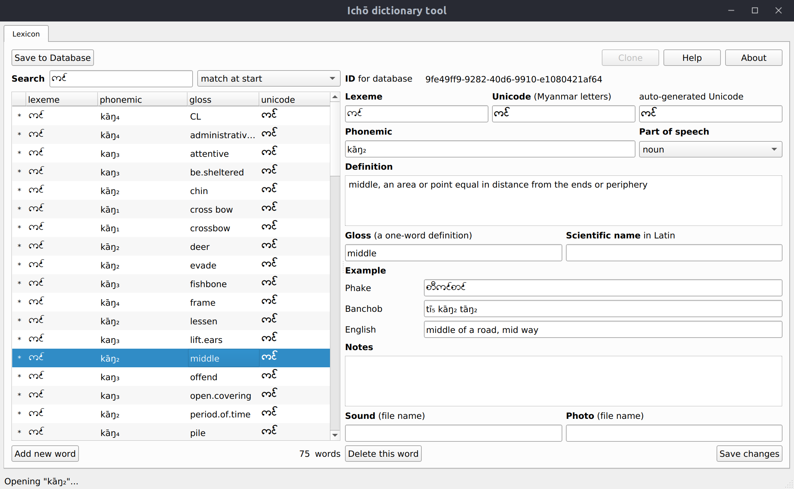

# Ichō.py

Ichō.py is a Python implementation of the Ichō dictionary tool, a management interface for collaborative dictionary creation that links in to the [AilotDict](https://github.com/phonemica/ailot) mobile phone dictionary software.

## Development history

The original version was built with Electron and Node.js, with PouchDB for local storage. It was intended more as a proof of concept than an actual production-quality tool. However, due to time constraints, the Electron version was put into the workflow for a couple dictionaries currently being developed.

It has been redeveloped in Python with Qt5 to provide a more lightweight implementation and a more reliable app for a wide range of platforms. Electron has issues and was never a good long-term cross-platform solution.

## Dependencies

Ichō is written in Python, version 3.6. The following packages are required for it to run. Versions shown in the table below are what it was developed with. Older versions may work.

| package | version |
|---------|---------|
| cloudant | 2.12 |
| urllib3 | 1.25.2 |
| sqlite3 | ? |
| pyqt5 | 5.12.2 |
| requests | 2.21.0 |

Note that `SQLite3` must be at least version 3.9 for JSON storage to work properly.

`python-cloudant` has replaced `python-couchdb` which is no longer maintained.

`PyQt5` is also required for the Qt version.

## Screenshots

